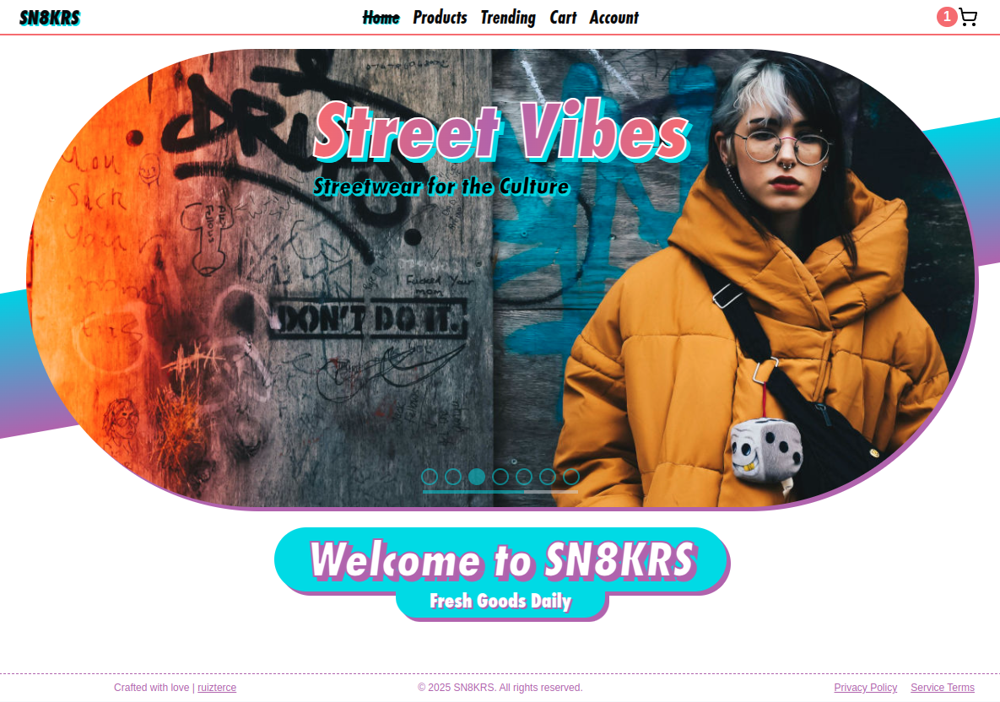
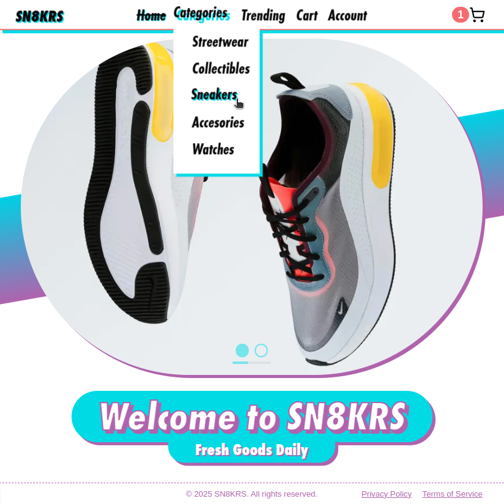
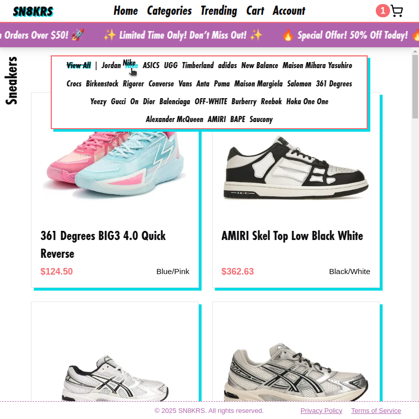
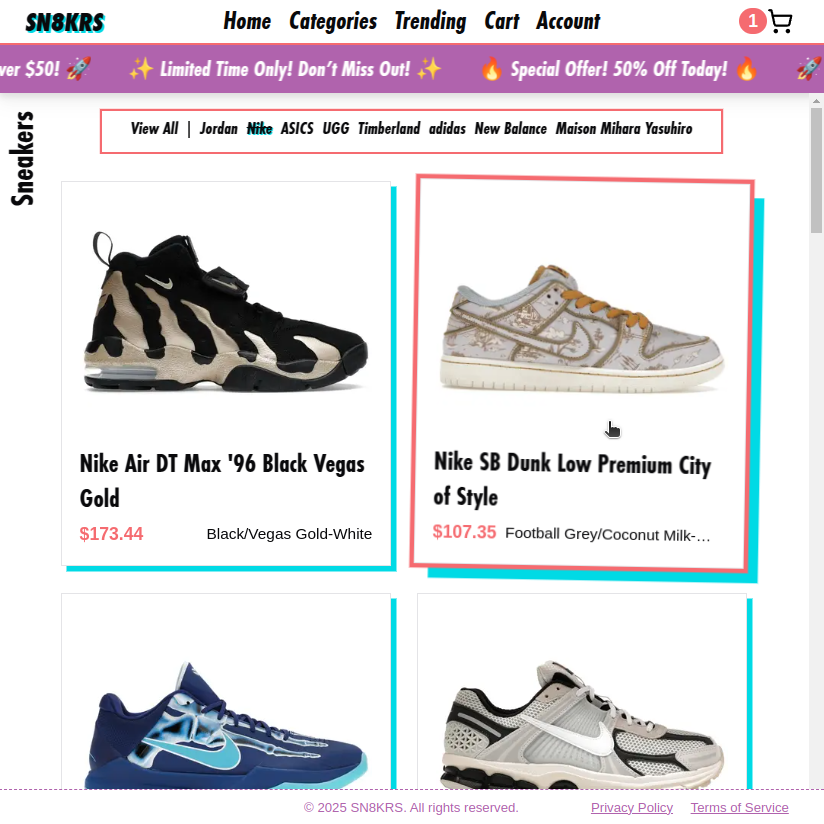
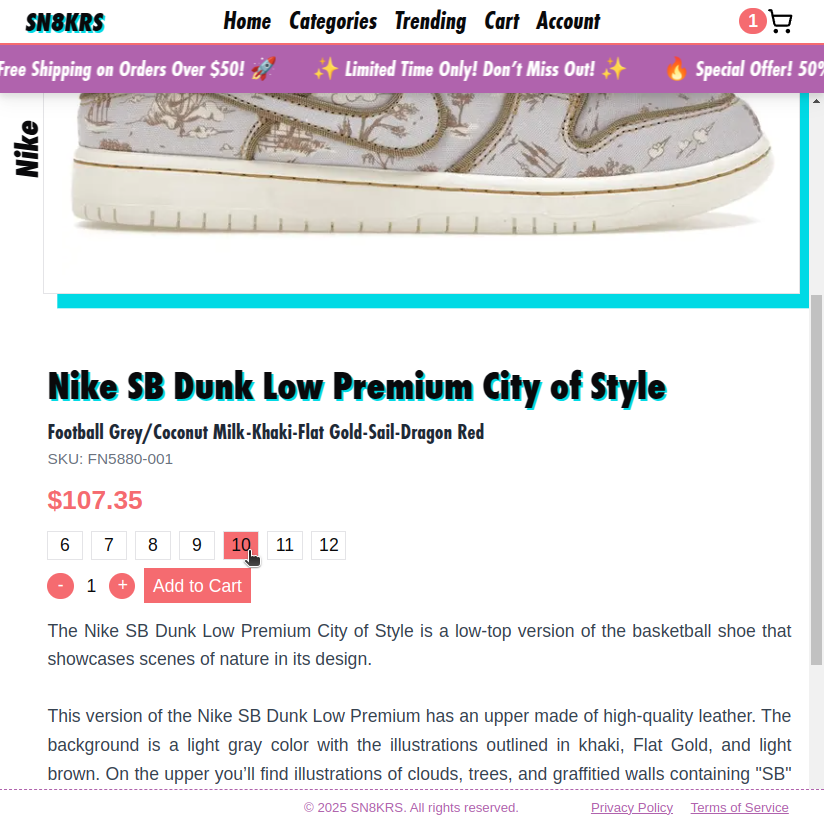
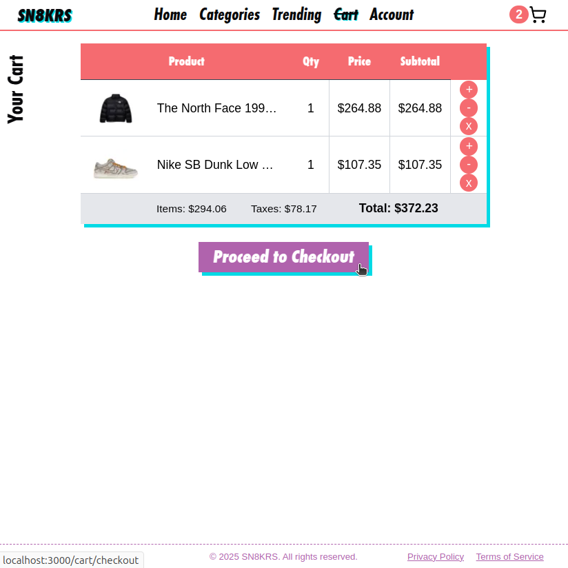
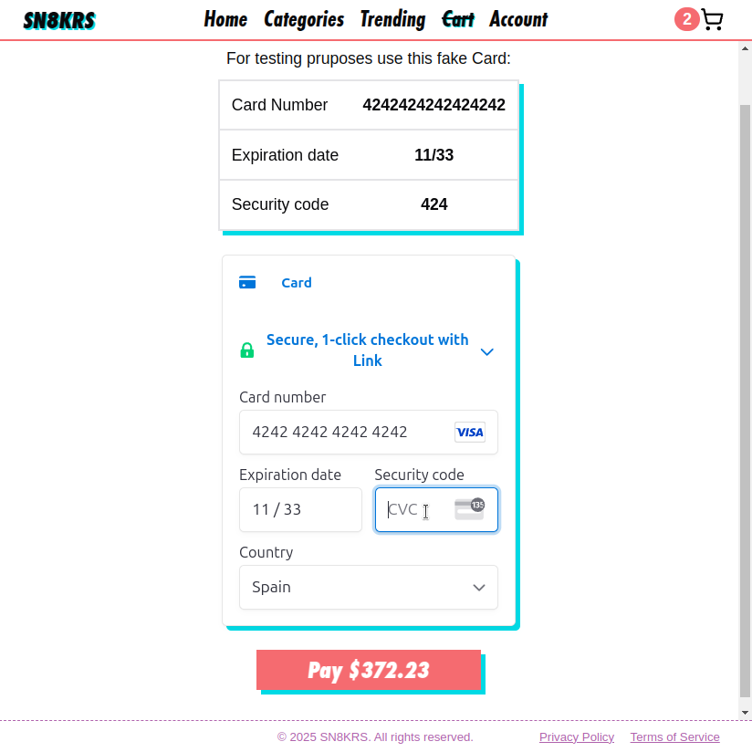
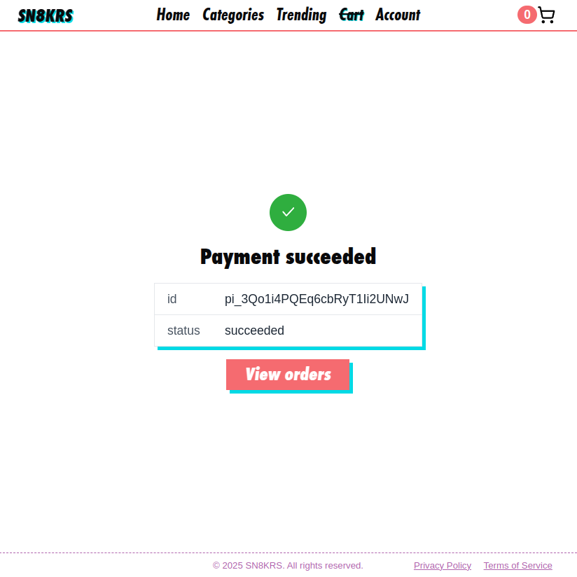
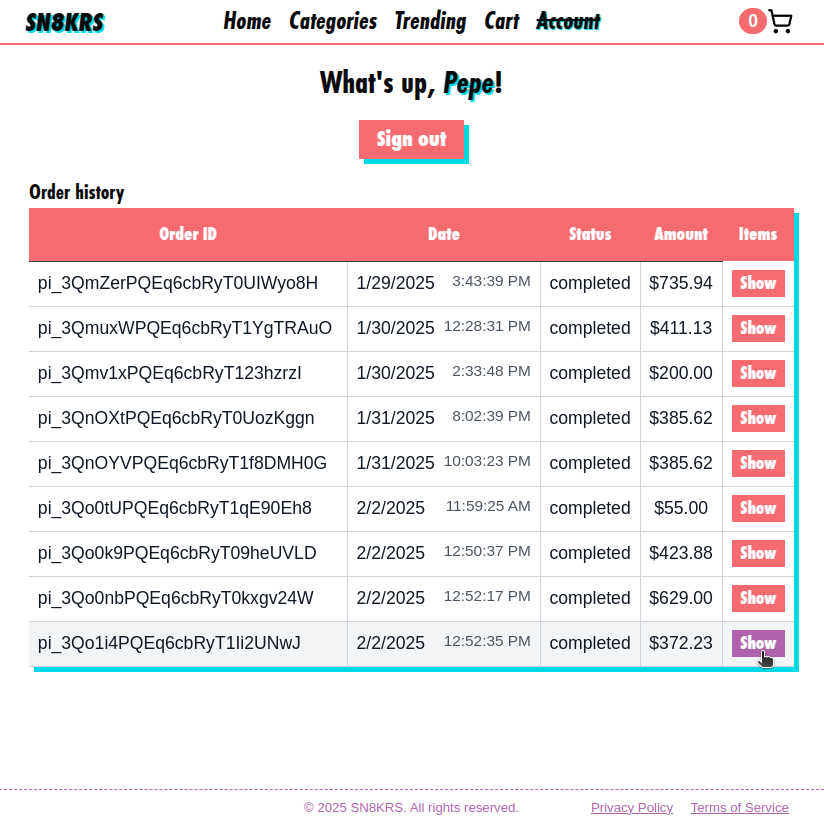
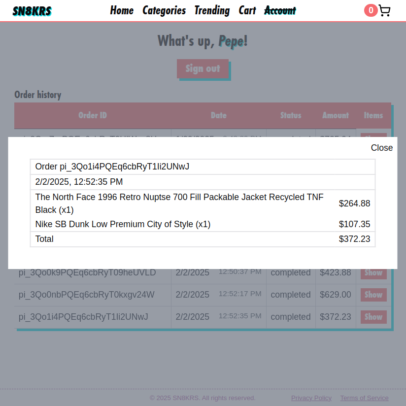

# 🛍️ SN8KRS - Serverless E-Commerce Platform

  

<i> A Serverless Next.js-based e-commerce platform for sneakers and streetwear</i>

---

## 🚀 Features

- **⚡ Serverless Architecture** – Built with **AWS Lambda**, **API Gateway**, and **DynamoDB** for a fully scalable backend.
- **🎨 Modern UI** – Developed with **Next.js** and **Tailwind CSS** for a sleek, responsive, and fast user experience.
- **🔑 Secure Authentication** – Uses **AWS Cognito** via **AWS Amplify** for user sign-up, login, and session management.
- **🛒 State Management** – **Redux** handles cart and authentication state across the application.
- **💳 Stripe Integration** – Secure and seamless checkout with **Stripe Payments**.
- **📦 Fast & Reliable Shopping Experience** – Designed for **sneakers and streetwear**, catering to urban fashion enthusiasts.

---

## 🛠️ Tech Stack

| Technology                | Usage                                                  |
| ------------------------- | ------------------------------------------------------ |
| **Next.js**               | Frontend framework for SSR & fast performance          |
| **AWS Lambda**            | Serverless backend functions                           |
| **API Gateway**           | Manages API endpoints                                  |
| **DynamoDB**              | NoSQL database for storing products, orders, and users |
| **AWS Cognito + Amplify** | User authentication                                    |
| **Redux**                 | Global state management (Cart & Auth)                  |
| **Stripe**                | Payment processing                                     |
| **Tailwind CSS**          | Modern and responsive UI                               |

---

## 📸 Screenshots

|   |   |
| - | - |
|  |  |
|  |  | | 
|  |  | 
|  | 
|  |

---

## 📜 License

This project is under the [GNU General Public License v3.0](https://www.gnu.org/licenses/gpl-3.0.html)
